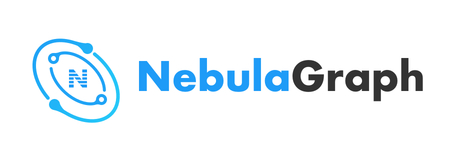

  
   中文 | <a href="README.md">English</a>
   世界上唯一能够容纳千亿个顶点和万亿条边，并提供毫秒级查询延时的图数据库解决方案 

  
  
  
  

**Nebula Graph** 的目标是为超大规模图数据提供高并发，低延时的读、写及计算。**Nebula Graph** 是一个开源项目，我们期待与社区合作共同推广图数据库。

**Nebula Graph** 的主要特点：

* 全对称分布式架构
* 可扩展
* 高可用
* 数据强一致
* 类 SQL 查询语言
* 用户鉴权
* 支持多存储后端

## 获取 Nebula Graph

除编译源代码外，也可使用 [Nebula Graph 镜像](https://hub.docker.com/r/vesoft/nebula-graph) 进行试用。
更多详情参见 [Get Started](docs/manual-CN/1.overview/2.quick-start/1.get-started.md)。您也可以在这里访问 [详细文档](docs/manual-CN/README.md)。

## 参与 Nebula Graph

**Nebula Graph** 是一个完全开源的项目，欢迎开源爱好者参与 **Nebula Graph** 社区，目前有以下贡献方式：

* 试用 **Nebula Graph** 并给出反馈
* 提交功能需求或者 issue
* 贡献代码，详情请参见 [如何贡献](docs/manual-CN/4.contributions/how-to-contribute.md)
* 帮助我们完善文档，详情参见 [贡献文档](docs/manual-CN/4.contributions/contribute-to-documentation.md)

## 许可证

**Nebula Graph** 使用 [Apache 2.0](https://www.apache.org/licenses/LICENSE-2.0) 许可证，您可以免费下载，修改以及部署源代码。您还可以将 **Nebula Graph** 作为后端服务部署以支持您的 SaaS 部署。

为防止云供应商从项目赢利而不回馈，**Nebula Graph** 在项目中添加了 [Commons Clause 1.0](https://commonsclause.com/) 条款。如上所述，**Nebula Graph** 是一个完全开源的项目，欢迎您就许可模式提出建议，帮助 **Nebula Graph** 社区更好地发展。

## 联系方式

* 使用 [GitHub issue tracker](https://github.com/vesoft-inc/nebula/issues) 提交 issue 或功能需求。
* 访问官网 [Home Page](http://nebula-graph.io/)。
*  

